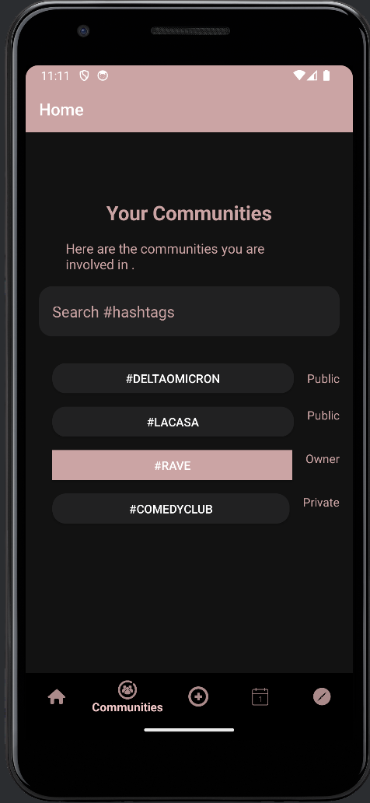
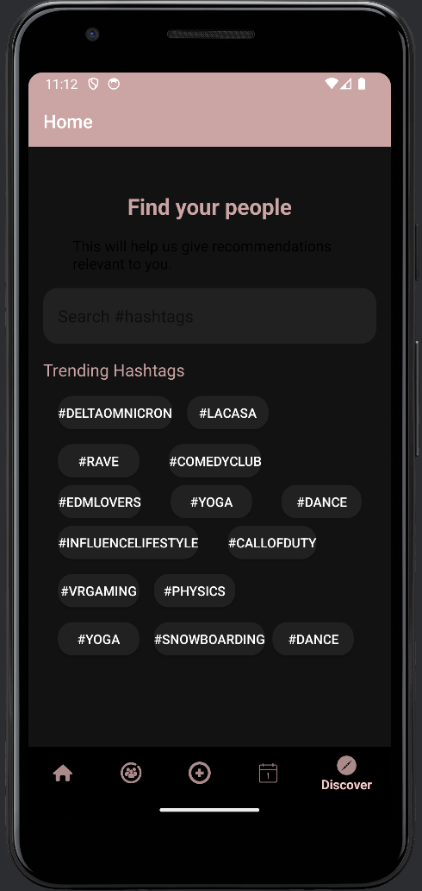
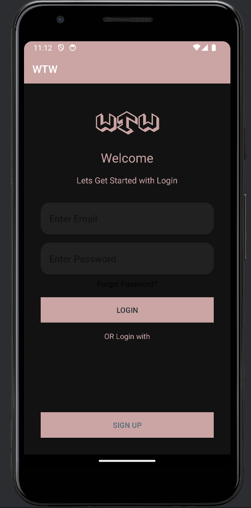
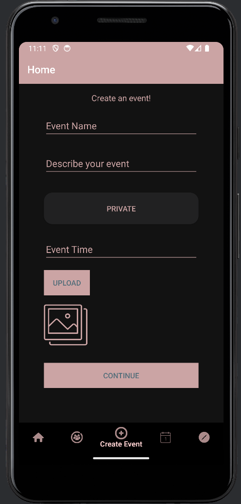

# WTW-EventManager-Android

Welcome to the WTW-EventManager Android app! Below are some screenshots showcasing the app's features and design.

## Screenshots

  

    
    
Communities Page

  

  

    
    
Discover Page

  

  

    
    
Login Page

  

  

    
    
Calendar Page

  

  

    
    
Event Page

  

## Features

- **Communities Page:** Explore and join different communities.
- **Discover Page:** Find new events and communities.
- **Login Page:** Securely access your account.
- **Calendar Page:** View events in a monthly calendar.
- **Event Page:** Get detailed information about events.

## Installation

Follow these steps to install the app...

## Usage

Learn how to use the app...

## Contributing

If you want to contribute...

## License

This project is licensed under the MIT License - see the [LICENSE](LICENSE) file for details.

